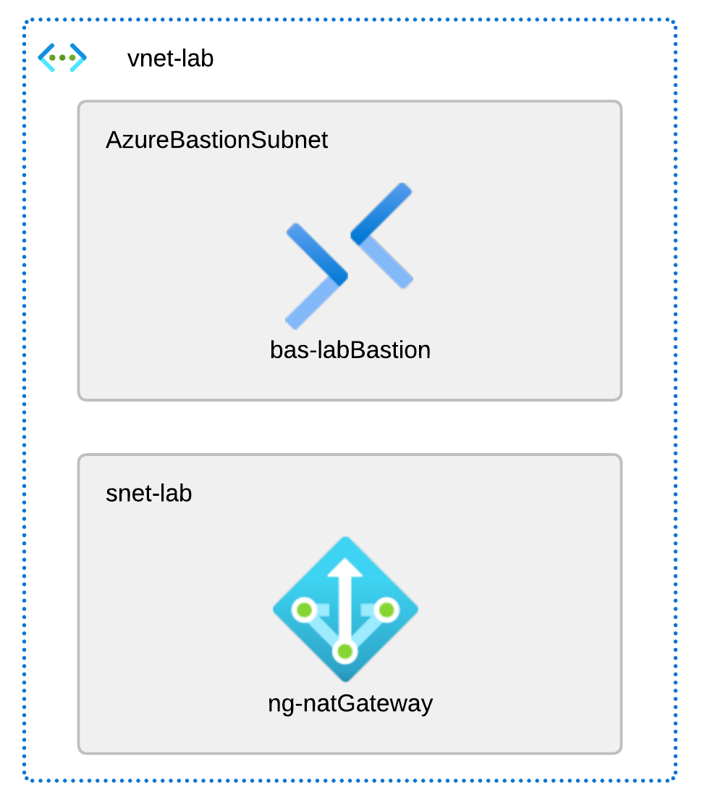

# Basic lab setup
The Bicep templates in this folder are used to deploy a basic lab setup. The finished setup will look like this:


You can then deploy stuff in the lab subnet, and it will be able to access the internet through the NAT gateway.

Deploy the template to a resource group by running the following command:
```powershell
new-azresourcegroupdeployment -name basicLabDeployment -resourcegroupname <resourcegroupname> -templatefile .\main.bicep
```