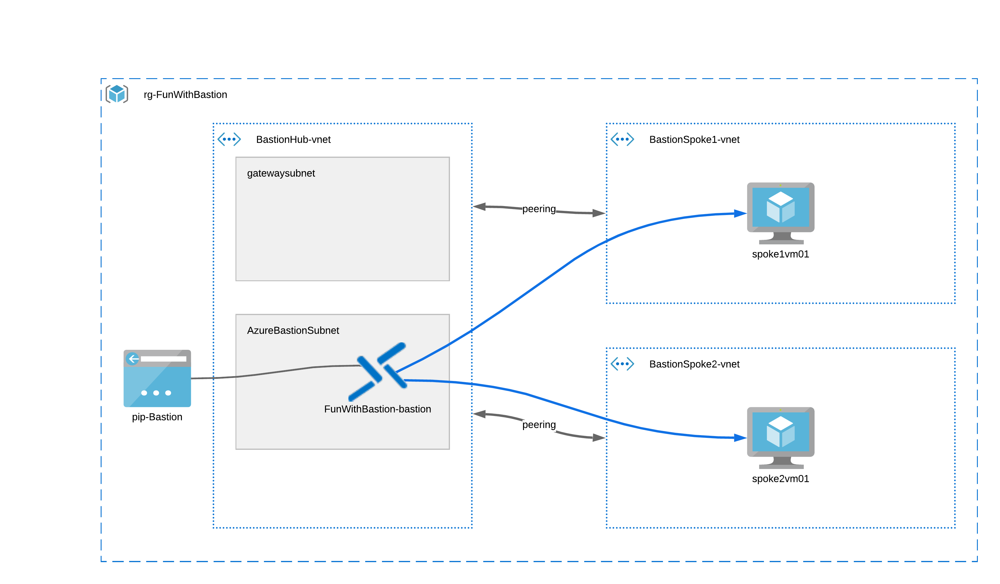

# Fun with Bastion
These bicep templates will create a hub and spoke environment with 2 VMs. Each VM is located
in its own vNet.
The hub vNet will include Bastion, which can then be used to remote into the VMs



To deploy it in a resource group named rg-FunWithBastion, you can do it like this (assuming you have Bicep installed):
```
New-AzResourceGroupDeployment -Name BastionTest -ResourceGroupName rg-FunWithBastion -TemplateFile .\FunWithBastion\main.bicep
```
